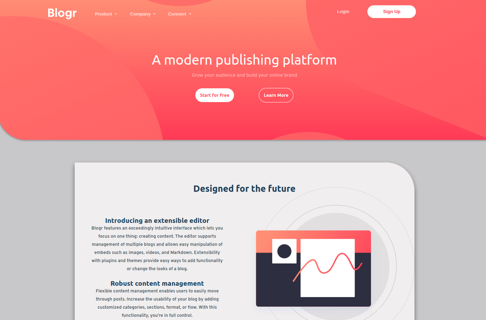

# Frontend Mentor - Solución de página de inicio de Blogr

Esta es una solución al [desafío de la página de destino de Blogr en Frontend Mentor](https://www.frontendmentor.io/challenges/blogr-landing-page-EX2RLAApP). Los desafíos de Frontend Mentor lo ayudan a mejorar sus habilidades de codificación mediante la creación de proyectos realistas.

## Tabla de contenido

- [Visión general](#overview)
  - [Desafío](#the-challenge)
  - [Captura de pantalla](#screenshot)
  - [Enlaces](#links)
- [Mi proceso](#my-process)
  - [Built with](#built-with)
- [Author](#author)

**Note: Delete this note and update the table of contents based on what sections you keep.**

## Overview

### The challenge

Los usuarios deben ser capaces de:

- Ver el diseño óptimo para el sitio según el tamaño de pantalla de su dispositivo
- Ver estados de desplazamiento para todos los elementos interactivos en la página

### Screenshot

### Links

- Live Site URL: [BLOGR](https://enu-blogr.netlify.app/)

## My process

### Built with

- Semantic HTML5 markup
- CSS custom properties
- Flexbox
- CSS Grid
- Mobile-first workflow

## Autor

- Website - [Enuel Monzón](https://enuelmonzon.netlify.app/)
- Frontend Mentor - [@Lordishh](https://www.frontendmentor.io/profile/yourusername)
- Instagram - [@enuel_developer](https://www.instagram.com/enuel_developer/)
